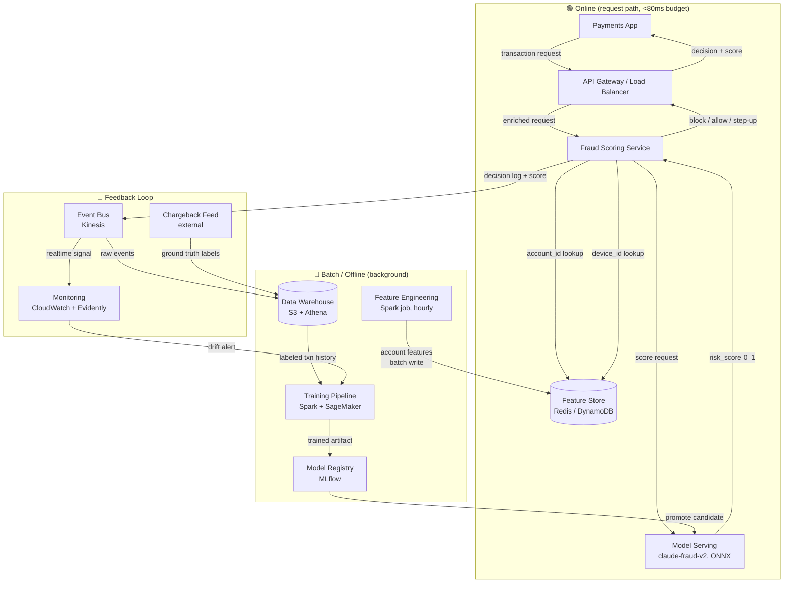

# Architecture: Real-Time Fraud Scoring (Scenario A)

## Serving Boundary

| Layer | Pattern | Latency |
|---|---|---|
| Fraud Scoring Service + Model Serving + Feature Store | **Online** | &lt;80ms p95 |
| Feature Engineering, Training Pipeline | **Batch** | hourly / weekly |
| Decision Log → Warehouse → Retraining | **Async feedback** | hours–days |

## Component Glossary

| Component | Role |
|---|---|
| **API Gateway** | Auth, rate-limiting, routes to scoring service |
| **Fraud Scoring Service** | Orchestrates feature lookup + model call + decision logic |
| **Feature Store (Redis/DynamoDB)** | Low-latency key-value store for account history & device fingerprint |
| **Model Serving (ONNX)** | Stateless inference pod; ONNX runtime for &lt;10ms inference |
| **Model Registry (MLflow)** | Tracks versions, promotes candidates to production |
| **Event Bus (Kinesis)** | Decouples decision logging from downstream consumers |
| **Monitoring (Evidently)** | Tracks score distribution drift, triggers retraining alert |
| **Training Pipeline** | Full retrain on labeled transactions + chargeback ground truth |
